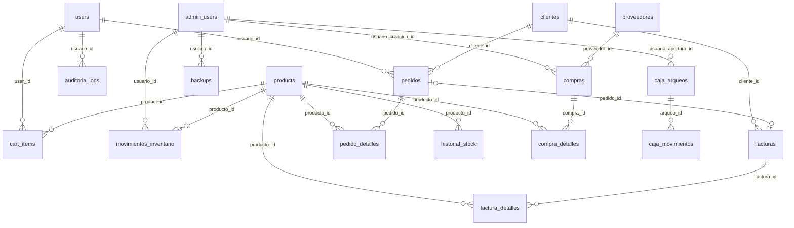

# Diagrama Entidad-Relación

## Esquema general de la base de datos (20 tablas)

## Detalle de Tablas

### 1. `users` — Usuarios (Clientes)
| Columna | Tipo | Descripción |
|---------|------|-------------|
| id | INT PK | Identificador único |
| nombre | VARCHAR(100) | Nombre completo |
| correo | VARCHAR(100) UNIQUE | Email de inicio de sesión |
| password | VARCHAR(255) | Hash bcrypt |
| cedula | VARCHAR(20) UNIQUE | Documento de identidad |
| telefono | VARCHAR(20) | Teléfono de contacto |
| foto_perfil | VARCHAR(255) | URL de avatar |
| is_active | BOOLEAN | Cuenta activa/inactiva |
| last_login | DATETIME | Último inicio de sesión |

### 2. `products` — Productos (80 registros iniciales)
| Columna | Tipo | Descripción |
|---------|------|-------------|
| id | INT PK | Identificador único |
| sku | VARCHAR(100) UNIQUE | Código interno |
| name | VARCHAR(255) | Nombre del producto |
| price | DECIMAL(10,2) | Precio unitario |
| stock | INT | Cantidad en inventario |
| category | VARCHAR(100) | Categoría |
| is_featured | BOOLEAN | Destacado en tienda |
| currency | VARCHAR(3) | Moneda (Bs/USD/EUR) |

### 3. `admin_users` — Administradores
| Columna | Tipo | Descripción |
|---------|------|-------------|
| id | INT PK | Identificador único |
| nombre | VARCHAR(100) | Nombre completo |
| correo | VARCHAR(100) UNIQUE | Email |
| usuario | VARCHAR(50) UNIQUE | Username de acceso |
| contrasena | VARCHAR(255) | Hash bcrypt |
| rol | ENUM | superadmin, admin, vendedor |
| activo | BOOLEAN | Cuenta activa |

### 4. `clientes` — Clientes (facturación)
Sincronizada con `users` para mantener datos fiscales separados.

### 5. `pedidos` — Pedidos
| Columna | Tipo | Descripción |
|---------|------|-------------|
| id | INT PK | Identificador único |
| numero_pedido | VARCHAR(20) UNIQUE | Número de orden (PED-2026-XXXXXX) |
| usuario_id | INT FK | Referencia a users |
| cliente_id | INT FK | Referencia a clientes |
| subtotal | DECIMAL(10,2) | Subtotal sin IVA |
| iva | DECIMAL(10,2) | Monto de IVA |
| total | DECIMAL(10,2) | Total a pagar |
| estado | ENUM | pendiente, procesando, enviado, entregado, cancelado, facturado |

### 6. `pedido_detalles` — Detalle de Pedidos
Líneas de producto asociadas a un pedido.

### 7. `facturas` — Facturas
| Columna | Tipo | Descripción |
|---------|------|-------------|
| id | INT PK | Identificador único |
| pedido_id | INT FK (unique) | Pedido origen |
| cliente_id | INT FK | Cliente facturado |
| numero_factura | VARCHAR(20) UNIQUE | Número de factura (FAC-2026-XXXXXX) |
| estado | ENUM | pendiente, pagada, anulada |

### 8. `factura_detalles` — Detalle de Facturas

### 9. `cart_items` — Carrito de Compras
| Columna | Tipo | Descripción |
|---------|------|-------------|
| id | INT PK | Identificador único |
| user_id | INT FK | Usuario propietario |
| product_id | INT FK | Producto agregado |
| quantity | INT | Cantidad |
| UNIQUE | (user_id, product_id) | Un producto por usuario |

### 10. `historial_stock` — Historial de Stock
Registra cambios manuales en el inventario.

### 11. `movimientos_inventario` — Movimientos de Inventario
Registra entradas, salidas, ajustes y devoluciones.

### 12. `proveedores` — Proveedores
| Columna | Tipo | Descripción |
|---------|------|-------------|
| id | INT PK | Identificador único |
| codigo | VARCHAR(50) UNIQUE | Código interno |
| nombre_comercial | VARCHAR(150) | Nombre comercial |
| ruc | VARCHAR(20) UNIQUE | Registro fiscal |
| estado | ENUM | activo, inactivo, suspendido |

### 13. `compras` — Órdenes de Compra
| Columna | Tipo | Descripción |
|---------|------|-------------|
| id | INT PK | Identificador único |
| numero_orden | VARCHAR(50) UNIQUE | Número de orden |
| proveedor_id | INT FK | Proveedor |
| estado | ENUM | cotizacion, aprobada, enviada, recibida_parcial, recibida_total, anulada |

### 14. `compra_detalles` — Detalle de Compras

### 15. `caja_arqueos` — Arqueos de Caja
Control de apertura/cierre de caja diario.

### 16. `caja_movimientos` — Movimientos de Caja
Ingresos y egresos registrados en cada arqueo.

### 17. `configuracion_sistema` — Configuración del Sistema
| Columna | Tipo | Descripción |
|---------|------|-------------|
| id | INT PK | Identificador único |
| clave | VARCHAR(100) UNIQUE | Nombre del parámetro |
| valor | TEXT | Valor configurado |
| grupo | VARCHAR(50) | Grupo (empresa, facturacion, etc.) |

Ejemplos: `iva_porcentaje=16`, `empresa_nombre=PIC`, `stock_minimo_alerta=5`.

### 18. `backups` — Respaldo de Base de Datos

### 19. `auditoria_logs` — Registro de Auditoría
| Columna | Tipo | Descripción |
|---------|------|-------------|
| id | INT PK | Identificador único |
| usuario_id | INT | Usuario que realizó la acción |
| accion | VARCHAR(100) | Tipo de acción |
| modulo | VARCHAR(50) | Módulo afectado |
| datos_anteriores | JSON | Estado previo (para ediciones) |
| datos_nuevos | JSON | Estado posterior |

### 20. `secuencias_facturacion` — Secuencias de Facturación
Controla números correlativos de pedidos y facturas por año.
